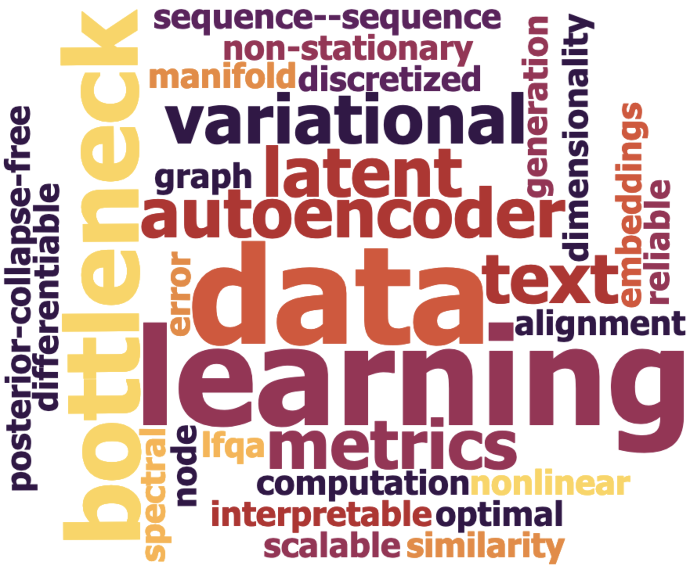

I am currently a ML/LLM Engineer with Meta. Prior to this, I was a Research Scientist with Criteo AI Lab, Amobee and LinkedIn respectively. Broadly my work encompasses applying different ML/DL, NLP/LLM and GNN techniques to solve related problems. My research focuses on designing & implementing novel algorithms which enable large-scale learning and includes:

* Machine/Deep Learning
* Natural Language Processing/ Large Language Models (NLP/LLM)
* Deep Graph/Geometric Learning
* Reinforcement Learning
<!-- * Nonlinear/Distributed Optimization -->

<!--  -->

I have 11+ years of research and 8+ years of developer experience during which I have been exposed and worked on solving a variety of problems. Please feel free to contact me at suchismi [at] buffalo.edu :)

Previously
----
I was a PhD student with the [Machine Learning & Data Science Research (MLDS) group](http://www.cse.buffalo.edu/ubds/) at the [State University of New York at Buffalo](http://www.buffalo.edu), working under [Varun Chandola](http://www.cse.buffalo.edu/~chandola). I have completed my Masters at [UB](http://www.buffalo.edu) as well with a perfect GPA and subsequently decided to pursue a PhD degree.

Predominantly my area of research is in large scale Machine Learning and Data Mining. More specifically my research focuses on designing, analyzing and implementing novel Machine Learning algorithms that take advantage of modern hardware to enable learning and mining of massive graphs and data sets.

